# Event-Driven Congestion Prediction (Bengaluru / ASTraM)

Forecast the **traffic impact of planned & unplanned events** (rallies, festivals,
breakdowns, accidents, construction, water-logging, VIP movement, …) and turn each
forecast into a concrete **manpower / barricading / diversion** plan.

**Dataset provenance.** The data is the **ASTraM** event log — *Actionable Intelligence
for Sustainable Traffic Management*, the AI platform run by the **Bengaluru Traffic
Police** (with Arcadis) — distributed for the **Gridlock Hackathon 2.0** (Flipkart × BTP).
It is **8,057 cleaned incidents, Nov 2023 – Apr 2024** (22 corridors, 10 zones, 294
junctions). It is a **point-event log**, not a sensor/speed grid, so the modelling uses
the methods that actually fit that data (gradient boosting + point-pattern / areal-count
statistics + survival analysis), not road-graph deep learning.

---

## Results (strict time-based split — train on the first 80% of the timeline, test on the most recent 20%)

| Layer | Question | Result |
|---|---|---|
| **Impact — road closure** | Will this event need a closure? → barricading/diversion | **AUC 0.812**, PR-AUC 0.285, recall 0.51 (base rate 7.2%) |
| **Impact — clearance time** | How long to clear? → manpower duration | GBM **MAE 95 min / median 32 min**; Weibull-AFT **concordance 0.715** (> GBM 0.692) |
| **Hotspot forecast** | How many events, where & when? → pre-positioning | **+10.4% skill vs seasonal-naïve**; rolling-CV MAE 0.146 ± 0.018 |
| **Recommendation** | What to deploy? | officers / barricades / diversion / tow, from the above |

`high_priority` is **not** claimed as a predictive win: in this data `priority == High`
is an administrative rule (the event is on a named corridor, 99.9% match), so any model
trivially recovers it. It is kept only as a "major-road importance" signal.

---

## Interactive dashboard (UI)

A **Streamlit** app (`app.py`) puts the whole system behind a map-driven interface:

```bash
pip install streamlit pydeck
python build_app_data.py     # train models + bundle map data -> models/app_bundle.pkl
streamlit run app.py         # opens http://localhost:8501
```
(The app auto-builds the bundle on first launch if it is missing.)

Four pages:

- **📊 Overview** — live metric cards (road-closure AUC, clearance error, hotspot skill,
  survival concordance) read straight from `results.json`, plus the top forecast corridors.
- **🗺️ Hotspot Map** — a pydeck map of Bengaluru with a **heatmap of where incidents
  cluster**, red markers for past road closures, and 3-D **columns per corridor sized by
  predicted event load** (taller/redder = busier). Filter by cause; hover for values.
- **🎯 Score an Event** — pick a cause, corridor, vehicle, time and location → get the
  **road-closure risk, expected clearance time, severity tier**, and a concrete
  **deployment plan** (officers / barricades / diversion / tow), shown on a map with the
  surrounding corridor hotspots.
- **📈 Model & Analysis** — the full metrics table (held-out test set) and all analysis
  figures.

Every prediction made in the UI is written to the run log (see *Logging* below).

## Deployment / hosting

The running app is lightweight — it needs **only** `streamlit, pydeck, scikit-learn,
pandas, numpy` (`requirements.txt`). The production models are sklearn
`HistGradientBoosting`, so there is **no GPU, no OpenMP/system library, and no secrets**
to configure (lightgbm/xgboost/lifelines in `requirements-dev.txt` are for offline
training only). Memory footprint is < 1 GB; the model bundle (~1.6 MB) is trained from the
committed CSV on first launch (`build_app_data.py`), so a fresh host is self-contained.

**Option A — Streamlit Community Cloud (free, easiest, recommended for a demo)**
1. Push this repo to GitHub.
2. At <https://share.streamlit.io> → *New app* → pick the repo, branch, and `app.py`.
3. In *Advanced settings* set **Python 3.12** (the repo's local 3.14 is newer than the
   platform default). `requirements.txt` is picked up automatically.
4. Deploy — you get a public `https://<app>.streamlit.app` URL.

**Option B — Hugging Face Spaces (free)**
Create a Space with the **Streamlit** SDK, push the repo (`app.py` + `requirements.txt`),
and it builds and hosts automatically.

**Option C — Docker → any cloud (production: custom domain, scaling)**
A `Dockerfile` is included (pre-trains the bundle into the image for fast cold starts):
```bash
docker build -t astram-congestion .
docker run -p 8501:8501 astram-congestion        # http://localhost:8501
```
Push that image to **Google Cloud Run, Render, Railway, Fly.io, AWS App Runner**, etc.
The container respects the platform's `$PORT`. Cloud Run example:
```bash
gcloud run deploy astram-congestion --source . --region asia-south1 --allow-unauthenticated
```

(Self-hosting on your own Ubuntu box also works: `pip install -r requirements.txt &&
streamlit run app.py --server.port 8501`, then reverse-proxy it behind nginx.)

## Logging

All runs log to `logs/` via `congestion/logging_utils.py`:

- `logs/run_YYYYMMDD.log` — timestamped progress for every training / build / UI action.
- `logs/metrics.jsonl` — **one JSON line per metric section per run**, so model quality is
  auditable over time (not just the latest number).
- `results.json` — the latest full metrics snapshot (consumed by the dashboard).

---

## Data analysis (figures)

### When events happen
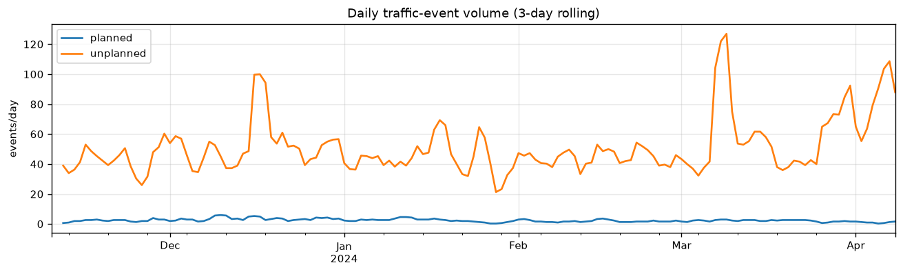
Daily event volume (3-day rolling), split planned vs unplanned. Unplanned incidents
dominate (~95%) and are steady at ~50/day; planned events are sparse and bursty.

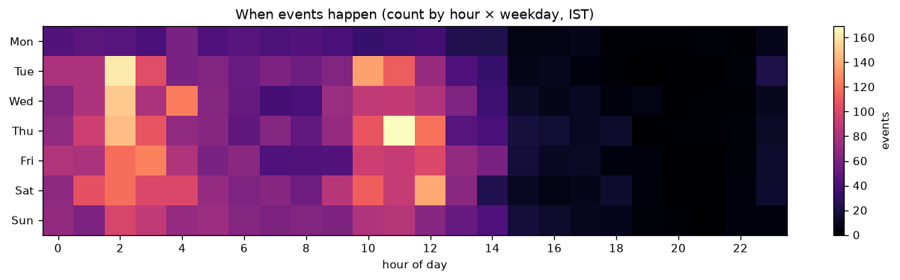
Reporting intensity by hour-of-day × weekday (IST). There is a strong, learnable
time-of-week structure — this is exactly what the hotspot forecaster exploits.

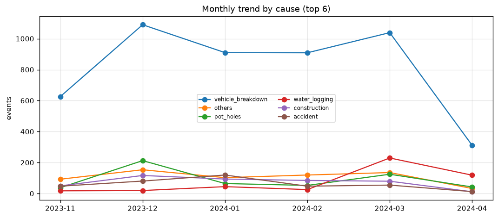
Monthly trend by cause: vehicle breakdowns dominate throughout; water-logging and
construction rise seasonally — useful for medium-term resourcing.

### What causes impact
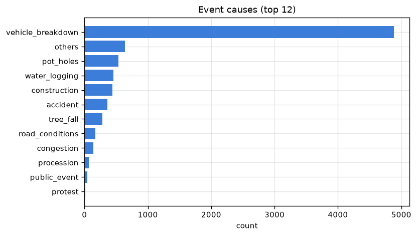
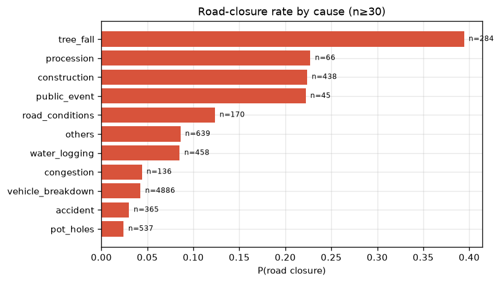
Vehicle breakdowns are the **most frequent** cause, but the **highest closure-rate**
causes are VIP movement, public events, tree-fall and construction. The impact model
learns this split — frequency ≠ severity.

### Where events cluster
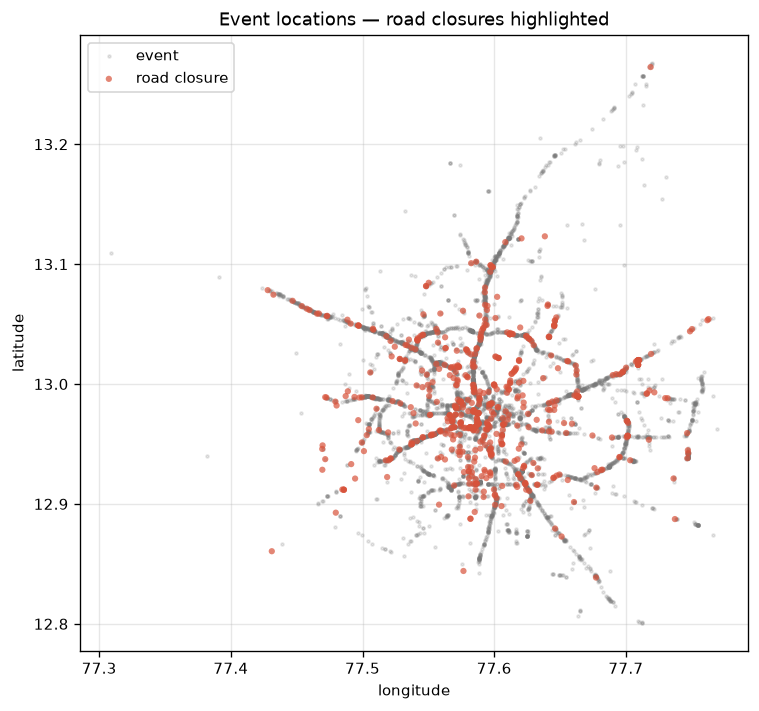
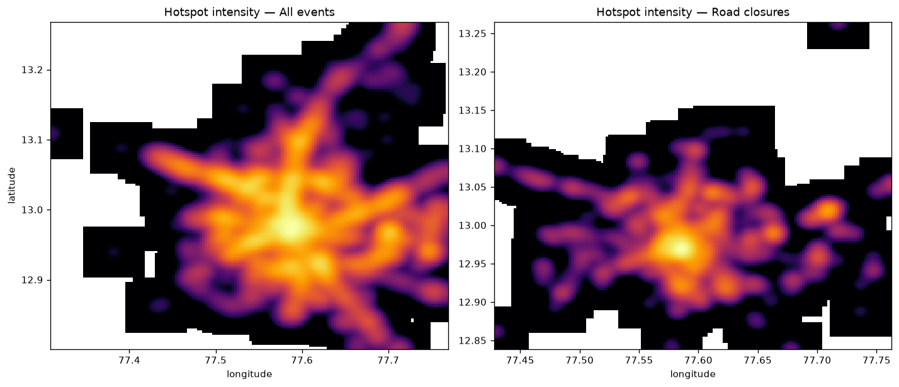
Causal Gaussian-kernel **KDE intensity surfaces** for all events vs. road closures.
Both peak at the city core with clear corridor "spokes"; closures are somewhat more
concentrated on arterial roads. These surfaces are sampled as features for the duration model.

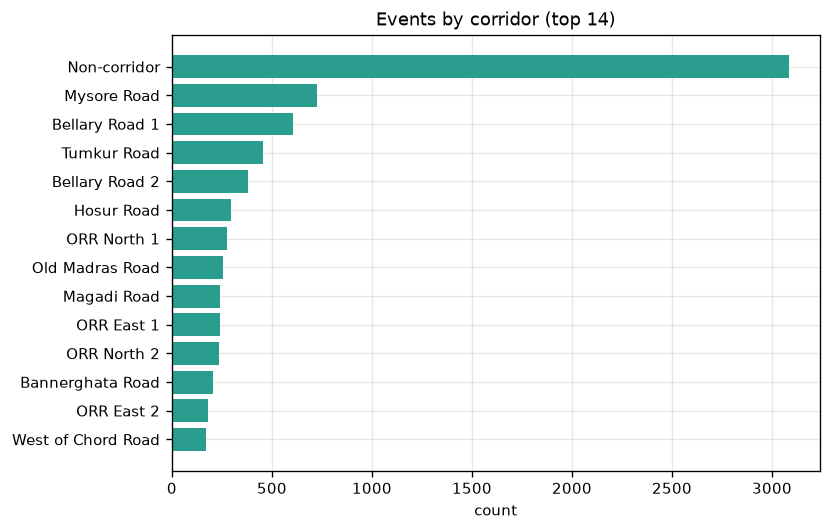
Event load by corridor (Mysore Road, Bellary Road, Tumkur Road lead the named corridors).

### Clearance time
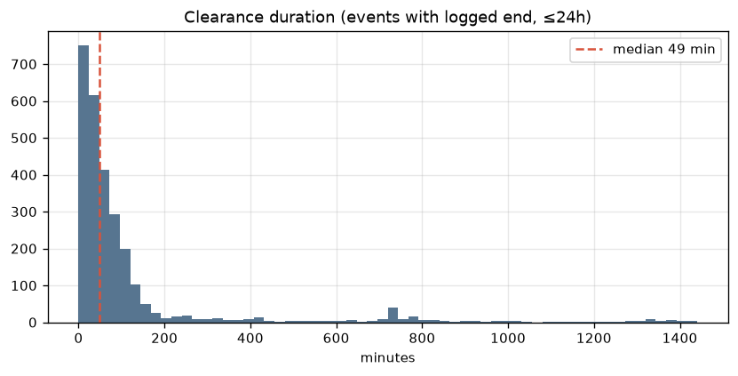
Clearance duration is heavily right-skewed (median ~68 min, long tail). Only ~34% of
events have a logged end time — motivating the **survival model** that also uses the
still-active (censored) events.

### Model performance
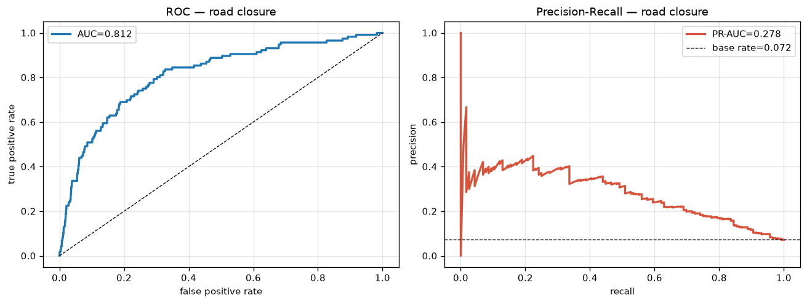
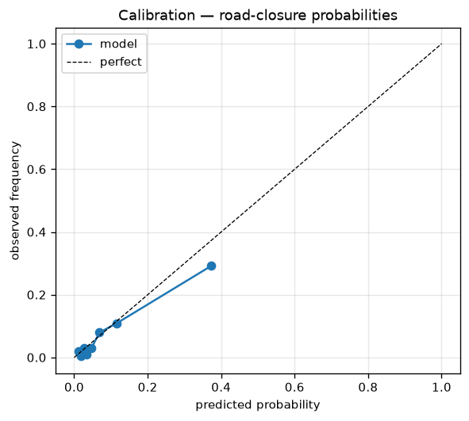
Road-closure ROC/PR curves and a calibration plot — predicted probabilities track
observed frequencies closely, which matters because the recommendation engine consumes
the raw probabilities.

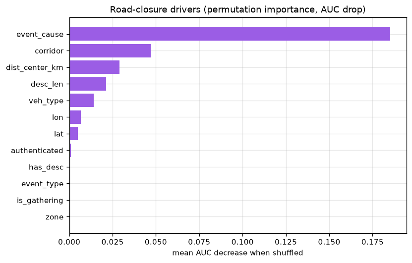
Permutation importance: `event_cause` ≫ `corridor` > distance-to-centre > **`desc_len`**
(a text feature discovered by the experiment search) > `veh_type`.

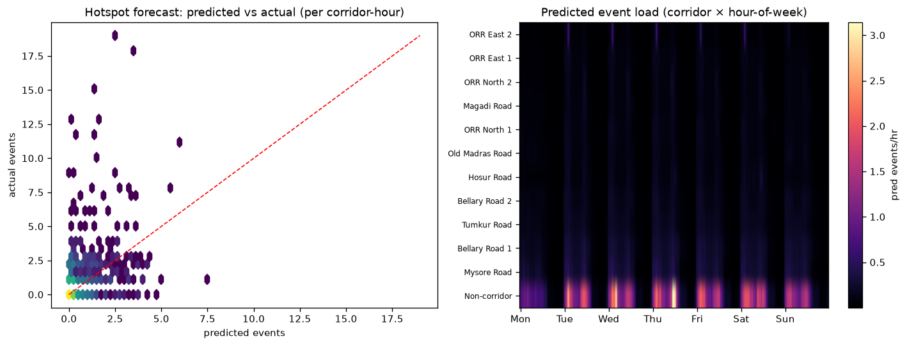
Left: predicted vs actual events per corridor-hour. Right: predicted event load across
the corridor × hour-of-week grid — the operational "where/when to pre-position" map.

---

## How the best model was chosen (not guessed)

Everything was selected by a **rolling-origin cross-validation experiment harness**
(`experiments.py`, live progress to the terminal), never by faith or fashion:

- **Model family is not the lever.** HistGBM / LightGBM / XGBoost / RandomForest /
  LogisticRegression all land within ~1 CV-std of each other (AUC 0.73–0.76). `event_cause`
  carries the signal regardless of model. I use **HistGradientBoosting** (native
  categoricals, calibrated probabilities, no `libomp` dependency).
- **Forward feature selection** found a **lean** set — `cat_core + spatial_coord + text`
  → CV-AUC **0.793**, beating the full 35-feature kitchen sink (0.756). Adding
  density/KDE, recency, high-card categoricals (junction/police-station), raw temporal,
  or corridor target-encoding **did not help** and were dropped.
- **Text features help** (description length / non-ASCII / presence): +0.016 AUC — a
  finding from the search, not the slides.
- **Hyperparameters**: shallower, more regularised trees (lr 0.03, 15 leaves) generalised
  best across time folds.

Final out-of-time road-closure AUC improved **0.787 → 0.812** from this process.

## Methods from the AID843 spatio-temporal course — *each ablation-tested*

| Method (lecture) | Where | Verdict |
|---|---|---|
| Spatial-lag feature / weights matrix W (2026-01-13) | hotspot forecaster | **Kept** (corr 0.451→0.468) |
| Gaussian-kernel causal KDE intensity (2026-02-12) | duration regressor | **Kept** (MAE 97.5→96.1) |
| Observation/recency weighting (2026-02-03) | duration regressor | **Kept** |
| Rolling-origin CV + seasonal-naïve skill (2026-02-17/03-10) | evaluation | **Kept** |
| Residual Moran's I diagnostic (2026-01-13) | evaluation | **Kept** (indicative: 22<30 units) |
| KDE/density on the **closure** classifier | — | **Rejected by ablation** (hurts AUC) |

## Methods from researching the dataset's domain (BTP-ASTraM / incident-log literature)

- **Survival analysis (Weibull AFT)** for clearance time — the strongest *new* idea: it
  uses the **706 still-active (right-censored) events** the regressor ignores and ranks
  clearance time better (concordance **0.715 vs 0.692**). See `congestion/survival.py`.
- Gradient-boosted trees for impact/duration, KDE hotspots, and a rule-based recommendation
  layer — already the backbone here. Heavy GNNs were correctly **skipped** (no speed/flow
  graph). The one public participant repo for this hackathon reports R²=1.0 — a leakage
  artefact, not a usable baseline.

---

## Layout

```
congestion/
  data.py          load + clean (timestamps, NULLs, cause normalisation, duration cleanup)
  features.py      causal features + KDE intensity, weights matrix, group definitions
  models.py        ImpactModel (closure/priority/duration) + HotspotModel (Poisson + spatial lag)
  survival.py      Weibull AFT clearance-time model (handles censored / active events)
  recommend.py     transparent manpower/barricade/diversion rule engine
  evaluate.py      rolling-origin CV, seasonal-naïve baseline, Moran's I
  logging_utils.py central logging -> logs/run_*.log + logs/metrics.jsonl
app.py             Streamlit dashboard (map + event scorer + metrics + figures)
build_app_data.py  train production models + bundle map data -> models/app_bundle.pkl
train.py           train + evaluate everything (live progress + logging) -> results.json
predict.py         score new incoming events -> deployment plan (CLI)
experiments.py     model-family / feature-group / hyperparameter search (-> experiment_results.json)
ablation.py        the original per-target feature ablation
tune_severity.py   tunes the recommendation severity weights to recorded impact
visualize.py       regenerate all figures/  (13 PNGs)
eda.py / eda2.py   exploratory analysis
```

**Severity tiers (Low/Moderate/High/Critical)** in the recommendation engine are not
hand-waved: `tune_severity.py` chooses the score weights (closure 0.55 · expected
duration 0.35 · disruptive-cause 0.10) so the tier *ranks events by their recorded impact*
(real closures + clearance times on held-out data). Actual closure rate rises cleanly
across tiers (≈1% → 7% → 19% → 35%); the earlier corridor-flag-driven score that labelled
almost everything "High" was removed.

## Run

```bash
python3 -m venv .venv && source .venv/bin/activate
pip install pandas numpy scikit-learn scipy matplotlib lightgbm xgboost lifelines streamlit pydeck

python train.py            # full evaluation -> results.json + logs/
python build_app_data.py   # train + bundle for the UI -> models/app_bundle.pkl
streamlit run app.py       # launch the dashboard at http://localhost:8501

# extras
python experiments.py      # model/feature/hyperparameter search -> experiment_results.json
python visualize.py        # regenerate figures/
python predict.py          # CLI: score example events into deployment plans
```
(LightGBM/XGBoost need OpenMP: `brew install libomp` on macOS. The core pipeline runs on
sklearn alone if you skip those.)

## Limitations / honest notes

- The log records **incidents**, not measured congestion (no speed/flow). "Impact" is
  proxied by `requires_road_closure` and clearance time — the best signals available.
- Clearance duration is logged for only ~34% of events; the survival model mitigates this
  by using censored (active) events, but estimates remain planning aids, not guarantees.
- Timestamps are stored UTC and reasoned about in IST; the reporting-time pattern is taken
  as-is (models learn whatever structure exists).
- Areal spatial statistics are *indicative only* at 22 corridors (course rule: ≥30 units);
  a finer grid would strengthen Moran's I / Gi*-style diagnostics.
